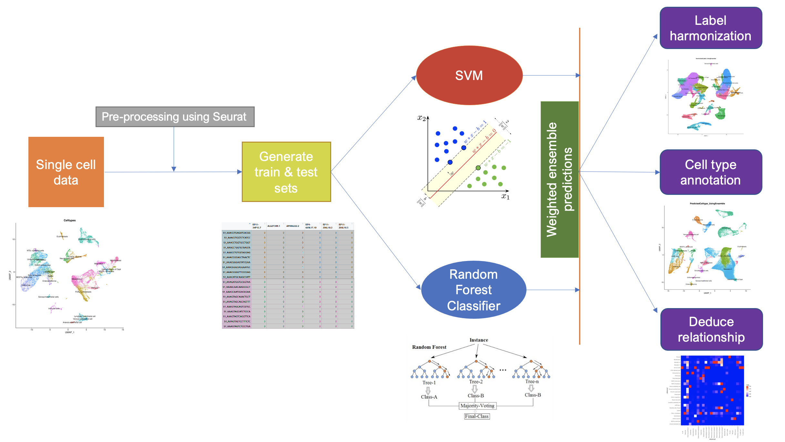

# ELeFHAnt
Ensemble Learning for Harmonization and Annotation of Single Cells (ELeFHAnt) provides an easy to use python package for users to annotate clusters of single cells, harmonize labels across single cell datasets to generate a unified atlas and infer relationship among celltypes between two datasets. It provides users with the flexibility of choosing a single machine learning based classifier or letting ELeFHAnt automatically use the power of  randomForest and SVM (Support Vector Machines) to make predictions. It has three functions 1) CelltypeAnnotation 2) LabelHarmonization 3) DeduceRelationship.

## Installation
```
Please download the Git repository and change directory to Git folder (example: ELeFHAnt-python) and run the command below:
Requirements: python3 (>=3.6)
pip install yourdirectory/elefhant/dist/elefhant-1.0.0-py3-none-any.whl
```

## Developers
```
Konrad Thorner (MS Bioinformatics) : Analyst Bioinformatics, Cincinnati Children's Hospital and Medical Center, OH - USA
GitHub Username: kthorner

Praneet Chaturvedi (MS Bioinformatics) : Lead Analyst Bioinformatics, Cincinnati Children's Hospital and Medical Center, Cincinnati, OH - USA
GitHub Username: praneet1988

```

## ELeFHAnt Model


## Random Forest
Random Forests is a powerful tool used extensively across a multitude of fields. It is based on generating a large number of decision trees, each constructed using a different subset of your training set. These subsets are usually selected by sampling at random and with replacement from the original data set. The decision trees are then used to identify a classification consensus by selecting the most common output.

## SVM (Support Vector Machines)
SVM is a well-established supervised machine learning algorithm. It finds a hyperplane that separates data points into classes, where training occurs through “maximizing the margin”. Training time tends to be longer as data increases. SVM was ranked highly for cell annotation when benchmarked against other tools.

## Ensemble Learning
ELeFHAnt provides users the ability to use ensemble learning for classifying celltypes for un-annotated datasets. In this mode ELeFHAnt uses the classification accuracy of both Random forest and SVM. It does so by assigning weights (accuracy while learning) to the predictions from each classifier. Weighted confusion matrices from each classifier are normalized based on highest number of cells shared among celltypes and assigned clusters, which are then added together to make the final ensemble predictions.

## Celltype Annotation Function
Celltype annotation is a function used to annotate celltypes in single cell datasets. It requires a reference dataset (a processed h5ad object with Celltypes in metadata) and a query dataset (a processed h5ad object with Clusters in metadata). One can choose from randomForest, SVM or Ensemble classification methods to learn celltypes from the reference dataset and then predict celltypes for query dataset.

## Label Harmonization Function
Label Harmonization is a function used to harmonize cell labels (celltypes) across single cell datasets. It requires a list of processed h5ad objects with a Celltypes column in metadata or an integrated h5ad object (with Celltypes and Clusters in the metadata). One can choose from randomForest, SVM or Ensemble classifiction methods.

## Deduce Relationship Function
Deduce Relationship is a function used to infer the similarity between celltypes across single cell datasets. The output is a heatmap that shows which celltype in one reference best corresponds to a celltype in another reference. It requires two reference datasets (both processed h5ad objects with Celltypes in the metadata). One can choose from randomForest, SVM or Ensemble classifiction methods.

# Celltype Annotation in detail
Celltype annotation is a function to annotate celltypes in single cell datasets.

## Requirements
It requires a reference dataset (a processed h5adbject with Celltypes in the metadata) and a query dataset (a processed h5ad object with Clusters in the metadata). One can choose from randomForest, SVM or Ensemble classifiction methods to learn celltypes from the reference dataset and then predict celltypes for the query dataset.

## How does the function work?
### Merge Reference and Query
Merge reference and query into a single object.
### Normalization
Run Log2 Normalization on the merged object.
### Feature Selection
Obtain highly variable features from the merged data  (default: 2000).
### Scaling
Scale the merged object for highly variable features.
### Generate train and test data
Training set is the reference data with celltypes extracted from scaled data. Test set is the query data with Clusters extracted from scaled data.
### Train Classifiers
Training data is used for training randomForest and SVM classifiers.
### Predict Celltypes
Each classifier after training is then used to classify cell types for the test data.
### Ensemble Learning
Ensemble learning based classsification uses both randomForest and SVM predictions to define final predictions. It does that by assigning weights (the accuracy while learning) to the predictions from each classifier. Weighted confusion matrices from each classifier are normalized based on highest number of cells shared among celltypes and assigned clusters, which are then added together to make the final ensemble predictions.

## How to use the function?
out = CelltypeAnnotation(reference = reference.object, query = mydata.object, downsample = False, downsample_to = 100, classification_method = "Ensemble", crossvalidationSVM = 10, validatePredictions = True, selectvarfeatures = 2000, ntree = 500, cost = 10 classification_approach = "ClassifyCells")
## What does each parameter do?
```
reference: a processed Scanpy object with Celltypes column in the metadata

query: a processed Scanpy object with clusters column in the metadata

downsample: logical Indicator (True or False) to downsample reference, enabling fast computation. if classification_method is set to "ClassifyCells_usingApproximation" query will be downsampled along with reference.

downsample_to: a numerical value > 1 to downsample cells [Default: 100] in reference and query for Celltypes and Clusters respectively

classification_method: choose classification method for learning and predicting celltypes. randomForest (decision trees), SVM (Support Vector Machines) or Ensemble (uses estimation robustness of both randomForest and SVM to predict)

crossvalidationSVM: if a integer value k>0 is specified, a k-fold cross validation on the training data is performed to assess the quality of the model

validatePredictions: logical indicator (True or False) to assess predictions by computing number of markers shared between assigned celltype and annotated cluster

selectvarfeatures: number of variable features to select for training (default: 2000)

ntree: number of trees randomForest classifier should build (Default: 500)

cost: control the error tolerance of the SVM classifier (Default: 10)

classification_approach: apprach to classify cells 1) ClassifyCells 2) ClassifyCells_usingApproximation. Default: ClassifyCells. We recommend using ClassifyCells_usingApproximation when reference has significantly less number of cells compared to query
```
## Output
```
1) query Scanpy object with predicted celltypes added to metadata of the object
2) Confusion matrices from each classification.method (when classification_method is set to ClassifyCells_usingApproximation) and gene set enrichment results are automatically saved in the current working directory
```

# Label Harmonization in detail
Label Harmonization is a function to harmonize cell labels (celltypes) across single cell datasets.

## Requirements
It requires a list of processed h5ad objects with a Celltypes in the metadata or an integrated h5ad object (with Celltypes and Clusters in the metadata). One can choose from randomForest, SVM or Ensemble classifiction methods to harmonize celltypes.

## How does the function work?
### Integrate Scanpy objects
Integrate list of h5ad objects into an integrated object 
### Scaling
Scale integrated data 
### Feature Selection
Integration features are set as selected features.
### Generate train and test data
Training set and test data are extracted using stratification on scaled integrated data. 60% of the data is used as training set and the remaining 40% is used as the testing set.
### Train Classifiers
Training data is used for training randomForest and SVM classifiers.
### Harmonize Celltypes
Each classifier after training is used to classify celltypes for the test data, thereby assiging harmonized labels to the integrated clusters.
### Ensemble Learning
Ensemble learning based classsification uses both randomForest and SVM predictions to define final predictions. It does so by assigning weights (accuracy while learning) to the predictions from each classifier. Weighted confusion matrices from each classifier are normalized based on highest number of cells shared among celltypes and assigned clusters, which are then added together to make the final ensemble predictions.

## How to use the function?
out = LabelHarmonization(data_objects = [object1,object2,object3...], integrated_atlas = object, perform_integration = True, downsample = True, downsample_to = 500, classification_method = "Ensemble", crossvalidationSVM = 10, validatePredictions = True, integrated.atlas = None, npcs = 30, resolution = 0.5, selectvarfeatures = 2000, ntree = 500, cost = 10)

## What does each parameter do?
```
data_objects: a list of processed Scanpy h5ad objects with Celltypes  their respective metadata to perform integration on

perform_integration: logical Indicator (True or False) to perform integration using list of Scanpy.objects

integrated_atlas: an integrated h5ad object with CellTypes and Clusters in metadata. Required if: perform_integration = FALSE

downsample: logical Indicator (True or False) to downsample h5ad objects or integrated object, enabling faster computation

downsample_to: a numerical value > 1 to downsample cells [Default: 100]

npcs: number of principal components to compute after integration

resolution: value of the resolution parameter, decides size of cell communities

classification_method: choose classification method for learning and harmonizing celltypes. Choices: randomForest (decision trees), SVM (Support Vector Machines) or Ensemble (uses learning robustness of both randomForest and SVM to predict)

crossvalidationSVM: if a integer value k>0 is specified, a k-fold cross validation on the training data is performed to assess the quality of the model

validatePredictions: logical indicator (True or False) to assess predictions by computing number of markers shared between assigned celltype and annotated cluster

selectanchorfeatures: number of anchor features to use for integrating datasets (Default: 2000)

ntree: number of trees randomForest classifier should build (Default: 500)

cost: control the error tolerance of the SVM classifier (Default: 10)
```
## Output
```
1) Integrated Scanpy object with harmonized celltypes added to metadata of the object
2) Confusion matrices from each classification_method and gene set enrichment results (if validatePredictions = True) are automatically saved in the current working directory
```

# Deduce Relationship
Deduce Relationship is a function used primarily to infer the similarity between celltypes across single cell datasets. As the name suggests, any kind of relationship between cell metadata (Clusters, Celltypes, idents etc.) could also be determined.
## Requirements
It requires two reference datasets (processed Scanpy Object with Celltypes column in the metadata). One can choose from randomForest, SVM or Ensemble classifiction methods to learn celltypes from the reference dataset and find the best corresponding celltypes in the other reference dataset. 

## How does the function work?
### Merge Reference1 and Reference2
Merge reference1 and reference2 into a single object
### Normalization
Run Log2 Normalization on the merged object
### Feature Selection
Obtain highly variable features from the merged data
### Scaling
Scale the merged object for highly variable features
### Generate train and test data
Training set is reference1 and test set is reference2, extracted from scaled data.
### Train Classifiers
Training data is used for training the randomForest and SVM classifiers.
### Infer Relationship
Each classifier after training is used to infer the relationship among celltypes between reference1 and reference2.
### Ensemble Learning
Ensemble learning based classsification uses both randomForest and SVM predictions to infer the relationship among celltypes between reference1 and reference2. It does so by assigning weights (accuracy while learning) to the predictions from each classifier. Weighted confusion matrices from each classifier are normalized based on the highest number of cells shared among celltypes and assigned clusters, which are then added together to make the final ensemble predictions.

## How to use the function?
out = DeduceRelationship(reference1 = None, reference2 = None, downsample = False, downsample_to = 100, classification_method = "Ensemble", crossvalidationSVM = 5, selectvarfeatures = 2000, ntree = 500, cost = 10)

## What does each parameter do?
```
reference1: a processed Scanpy h5ad object with Celltypes in the metadata

reference2: a processed Scanpy h5ad object with Celltypes in the metadata

downsample: logical Indicator (True or False) to downsample reference1 and reference2, enabling faster computation

downsample_to: a numerical value > 1 to downsample cells [Default: 100] in reference and query for Celltypes and Clusters respectively

classification_method: choose classification method for learning and predicting celltypes. randomForest (decision trees), SVM (Support Vector Machines) or Ensemble (uses estimation robustness of both randomForest and SVM to predict)

crossvalidationSVM: if a integer value k>0 is specified, a k-fold cross validation on the training data is performed to assess the quality of the model

selectvarfeatures: number of variable features to select while training (default: 2000)

ntree: number of trees randomForest classifier should build (Default: 500)

cost: control the error tolerance of the SVM classifier (Default: 10)
```
## Output
```
1) a seaborn heatmap object
2) Confusion matrices from each classification_method and heatmap are automatically saved in current working directory
```

# Citation
Please cite our preprint: https://www.biorxiv.org/content/10.1101/2021.09.07.459342v1 when using ELeFHAnt in your research.

# Bugs/Issues
Please report bugs, issues and improvements using the issues section of the GitHub page.

# Contribute to Code
Please open a pull request to contribute to existing code in terms of improvements / new features / bug removal.
